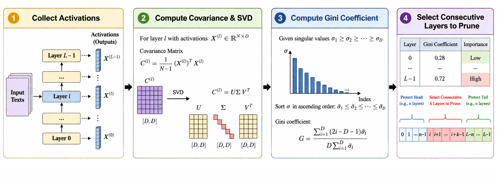
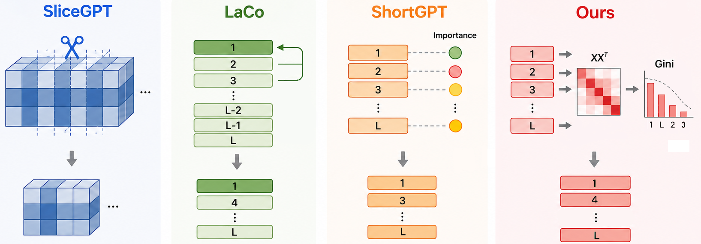
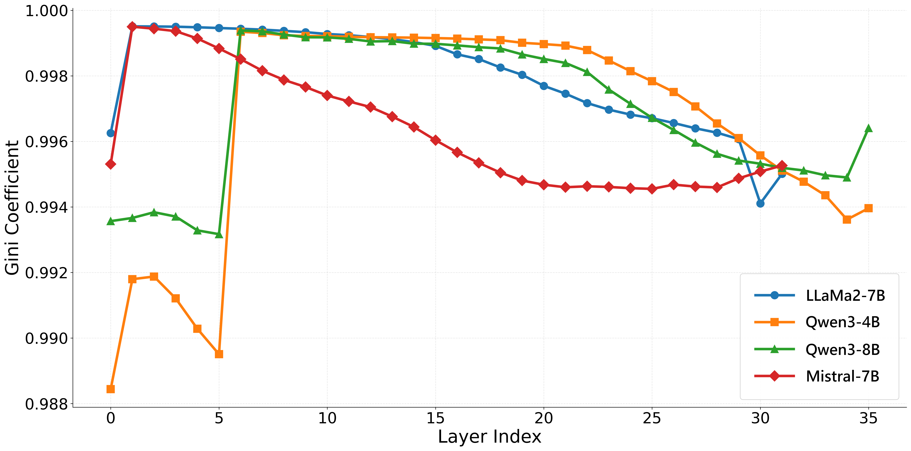
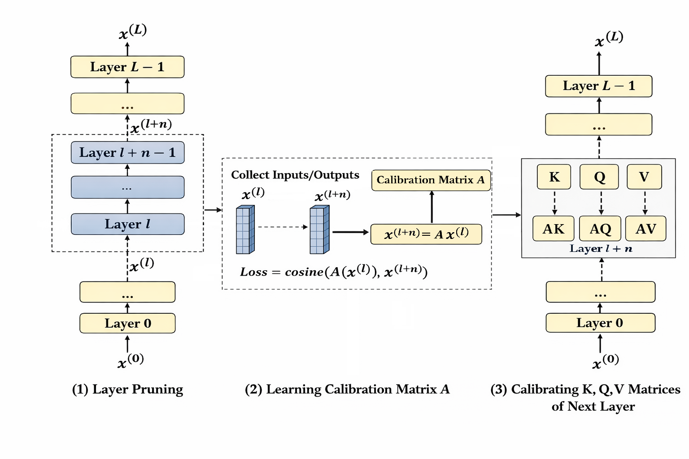
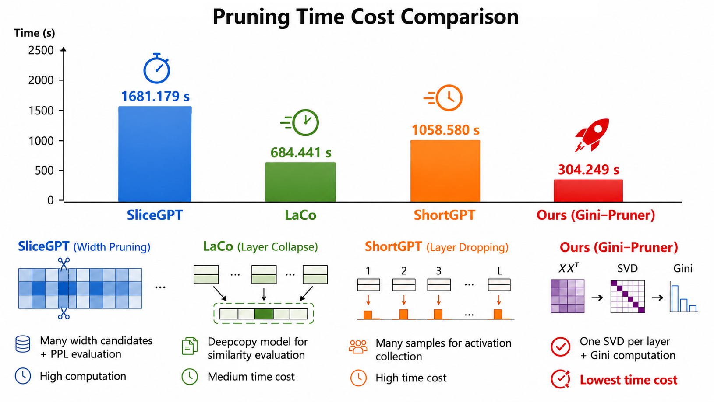
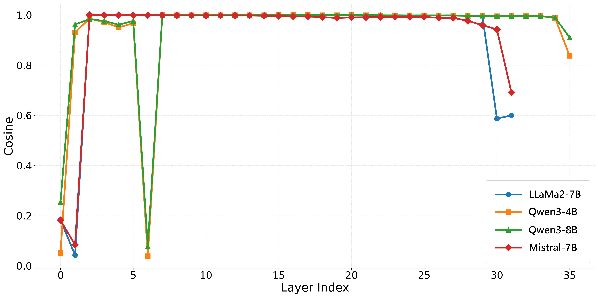
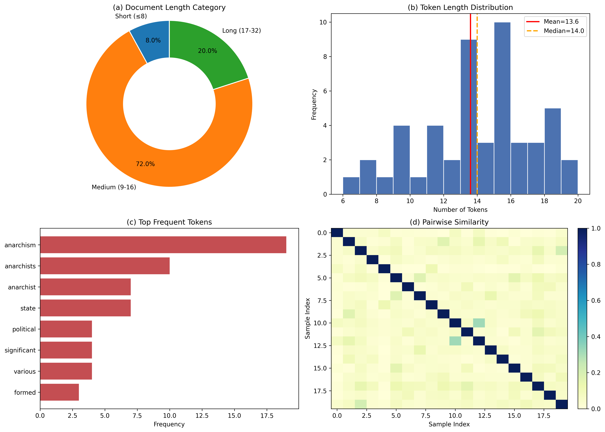

# Gini-Prune: Fast Post-Training Layer Pruning for Large Language Models via Hidden-State Spectral Inequality

This repository provides the anonymous implementation for **Gini-Prune**, a fast post-training layer pruning method for large language models based on **hidden-state spectral inequality**.

Gini-Prune uses the **Gini coefficient** of layer-wise hidden-state covariance spectra to identify weakly transformative Transformer layers. It performs low-Gini contiguous block pruning to reduce model depth and improve pruning-search efficiency.

This repository is anonymized for peer review.

## Overview

As model depth and parameter scale continue to grow, the deployment cost of large language models keeps increasing. Layer pruning is a practically valuable compression strategy because it directly removes Transformer blocks and shortens the sequential computation path.

Existing post-training layer pruning methods still face two key challenges:

1. Layer-importance estimation often relies on local input-output similarity, heuristic layer selection, or repeated deletion verification.
2. Some pruning methods require complex search, model reconstruction, or recovery procedures, leading to high preprocessing cost.

Gini-Prune addresses these issues by using hidden-state spectral inequality as a simple and training-free layer scoring signal.

## Method

Gini-Prune consists of four main steps:

1. Collect hidden states from calibration samples.
2. Construct layer-wise covariance matrices.
3. Compute singular-value spectra and spectral-Gini scores.
4. Select and remove a low-Gini contiguous layer block.

<p align="center">
  
</p>

<p align="center">
  <b>Figure 1.</b> Workflow of Gini-Prune. The method collects activations, computes covariance matrices and singular-value spectra, obtains Gini scores, and selects a low-Gini contiguous block for pruning.
</p>

The following figure provides an intuitive comparison between Gini-Prune and representative pruning baselines.

<p align="center">
  
</p>

<p align="center">
  <b>Figure 2.</b> Comparison between SliceGPT, LaCo, ShortGPT, and Gini-Prune.
</p>

## Spectral-Gini Scoring

For each Transformer layer, Gini-Prune constructs a covariance matrix from calibration hidden states and computes its singular-value spectrum. The Gini coefficient is then used as a compact measure of spectral anisotropy.

Layers with lower spectral-Gini scores are treated as weakly transformative candidates. Gini-Prune searches for a low-Gini contiguous block and removes it to obtain a shallower model.

<p align="center">
  
</p>

<p align="center">
  <b>Figure 3.</b> Layer-wise spectral-Gini score profiles for different models.
</p>

## Foldable Calibration

Gini-Prune can optionally apply a foldable low-rank linear bridge after pruning. The bridge is learned between the input and output hidden states of the removed block and is folded into the following attention projection matrices.

<p align="center">
  
</p>

<p align="center">
  <b>Figure 4.</b> Foldable bridge calibration after layer pruning.
</p>

## Results Overview

Gini-Prune is evaluated on multiple model families, model sizes, and pruning ratios, including LLaMA2-7B, Mistral-7B, Qwen3-4B, and Qwen3-8B. The evaluation is conducted with a unified LM-eval benchmark suite.

<p align="center">
  
</p>

<p align="center">
  <b>Figure 5.</b> Pruning-search time comparison. Gini-Prune substantially reduces pruning-search cost compared with representative pruning baselines.
</p>

## Diagnostic Figures

The following diagnostic figures are provided for additional analysis.

<p align="center">
  
</p>

<p align="center">
  <b>Figure 6.</b> Layer-wise input-output cosine similarity profiles.
</p>

<p align="center">
  
</p>

<p align="center">
  <b>Figure 7.</b> Calibration-data statistics, including text-length categories, token-length distribution, frequent tokens, and pairwise similarity.
</p>

## Repository Structure

```text
.
├── README.md
├── code/
│   ├── args.py
│   ├── cache.py
│   ├── en_wiki.py
│   ├── environment.yml
│   ├── fold_lowrank.py
│   ├── gini.py
│   ├── pruner.py
│   ├── readme.md
│   ├── teacher.py
│   └── test.py
└── docs/
    └── figures/
        ├── pruning_methods.png
        ├── calibration_workflow.png
        ├── pruning_time_comparison.png
        ├── calibration_data_overview.png
        ├── cosine_similarity_profiles.png
        ├── gini_score_profiles.png
        └── gini_prune_workflow.png
```

## Installation

We recommend using the provided Conda environment file.

```bash
conda env create -f code/environment.yml
conda activate gini-prune
```

If needed, the environment can also be built manually with common LLM dependencies such as:

```text
torch
transformers
datasets
accelerate
peft
numpy
scipy
```

## Usage

The main implementation files are placed under the `code/` directory.

### Compute Spectral-Gini Scores

```bash
python code/gini.py
```

### Run Layer Pruning

```bash
python code/pruner.py
```

### Run Foldable Low-Rank Calibration

```bash
python code/fold_lowrank.py
```

### Run Evaluation / Test Script

```bash
python code/test.py
```

Please check `code/args.py` for configurable arguments and model paths.

## Evaluation

The paper evaluates Gini-Prune with a unified LM-eval benchmark suite. The tasks include:

```text
CMNLI, HellaSwag, PIQA, WSC273, WinoGrande, CommonSenseQA,
BoolQ, MMLU, CMMLU, RACE-H, RACE-M, C3, ARC-e, ARC-c
```

The evaluation scripts can be adapted to local model paths and benchmark settings.

## Notes on Anonymity

This repository is prepared for anonymous peer review. Please do not add author names, institutional information, email addresses, acknowledgements, or non-anonymous project links before the review process is completed.

## Citation

Citation information will be added after the review process.

```bibtex
@inproceedings{anonymous2026giniprune,
  title     = {Gini-Prune: Fast Post-Training Layer Pruning for Large Language Models via Hidden-State Spectral Inequality},
  author    = {Anonymous},
  booktitle = {Anonymous Conference Submission},
  year      = {2026}
}
```

## License

The license will be added after the review process.
